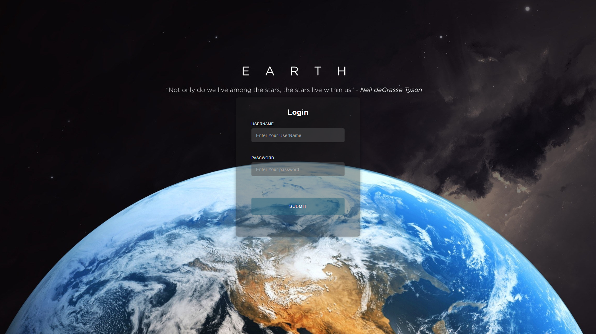

# 🔐 Login Form

A stylish and responsive login form built using HTML, CSS, and JavaScript.  
This project demonstrates modern UI/UX practices for user authentication interfaces.

---

## 🚀 Live Demo

🌐 [View Live Demo](https://abd-el-rahman-adel-dev.github.io/login-form/)

---

## 📸 Screenshot

 <!-- أض٠صورة حقيقية من واجهة المشروع إذا متوÙرة -->

---

## ✨ Features

- Modern and clean design  
- Responsive on all screen sizes  
- Input validation  
- Eye icon toggle to show/hide password  
- Smooth transitions and animations

---

## 🛠 Tech Stack

- HTML5  
- CSS3  
- JavaScript (Vanilla)

---

## 📦 Getting Started

To preview or use this project locally:

```bash
git clone https://github.com/abd-el-rahman-adel-dev/login-form.git
cd login-form
open index.html
```

Or just double-click `index.html` in your file manager.

---

## 📁 Project Structure

```
📦 login-form
┣ 📂 css
┃ ┗ 📜 style.css
┣ 📂 images
┣ 📜 index.html
┣ 📜 script.js

```

---

## 📄 License

This project is licensed under the [MIT License](./LICENSE).

---

## 🙋‍♂️ Author

- [Abd El-Rahman Adel](https://github.com/abd-el-rahman-adel-dev)
- [LinkedIn](https://www.linkedin.com/in/abdelrahman-adel-webdev)

---

> ⭐ If you found this project useful, please consider giving it a star!
